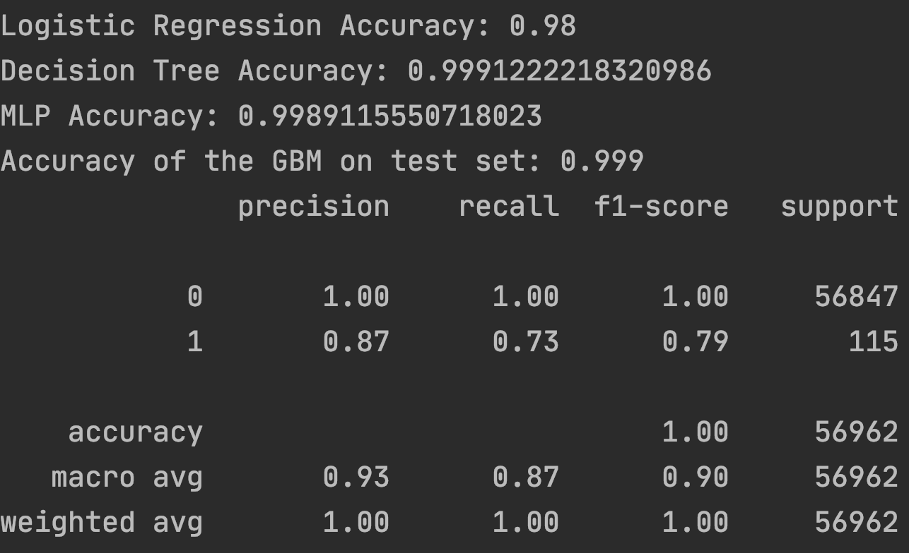
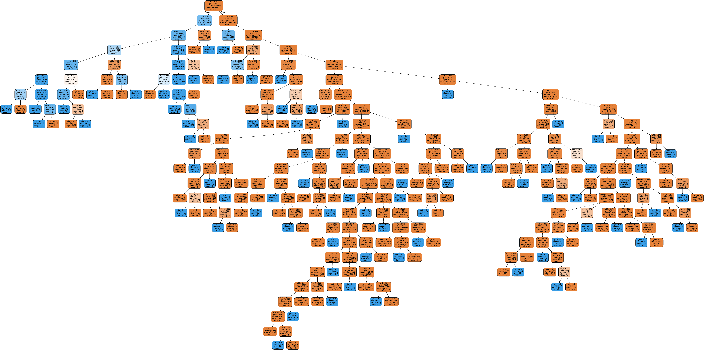

# Detect Credit Card Fraud
Implemented machine learning algorithms to detect credit card fraud in Python

## Instructions
1. Make sure all the proper libraries are imported (i.e _pandas, numpy, sklearn_) and packages are installed.
2. Run `fraudDetect.py` to run the different machine learning algorithms.

## Key Machine Learning Algorithms
Machine Learning Algorithms concepts used in the code. Listed Below:

- **General Logistic Regression Model**: Logistic regression is used for modeling the outcome probability of a class such as pass/fail.
- **Decision Tree**: Decision tree algorithm to plot the outcome of a decision using entropy or GINI Index.
- **MLP(Multi-layer Perceptron)**: Learn the patterns using the historical data and are able to perform classification on the input data.
- **Gradient Boosting (GBM)**: A machine learning technique for regression and classification problems.

## Project Structure 

- `fraudDetect.py` -- The implentation of the machine learning alorigthms on the train and test set.
- `createFormula.py` -- Module to create the function used in the logistic regression model.
- `fraud.png` -- Output of the decision tree created by the model.

## Results

`Sample Output:`

`Decision Tree:`

